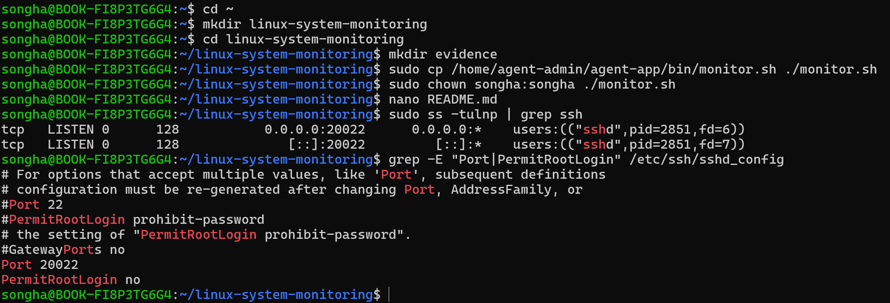
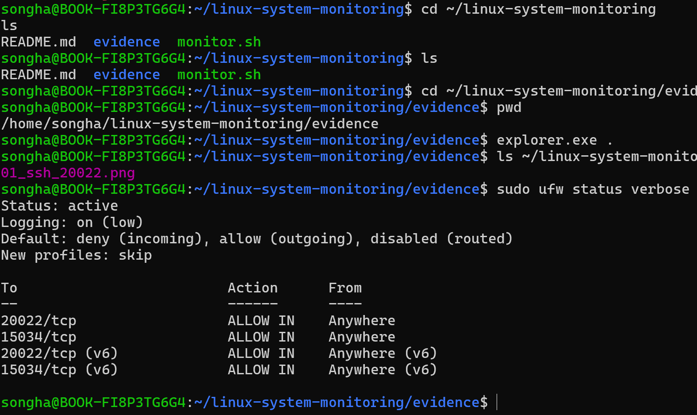
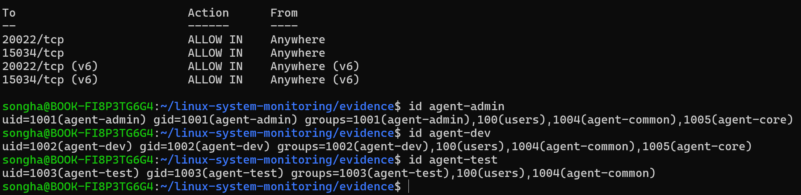
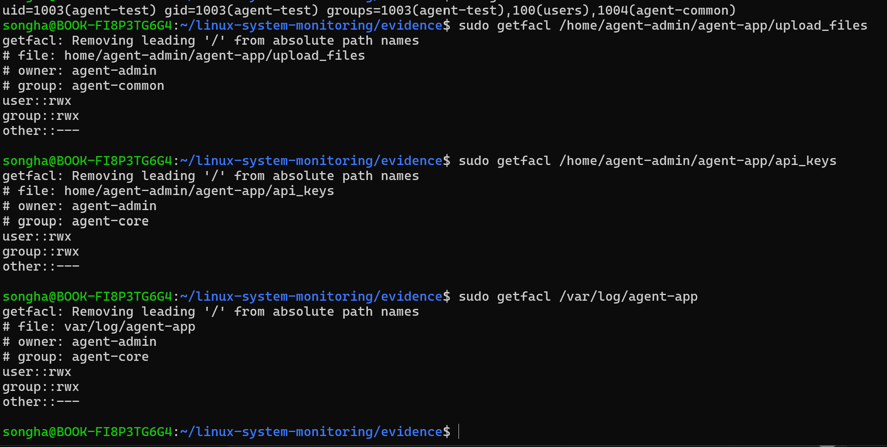
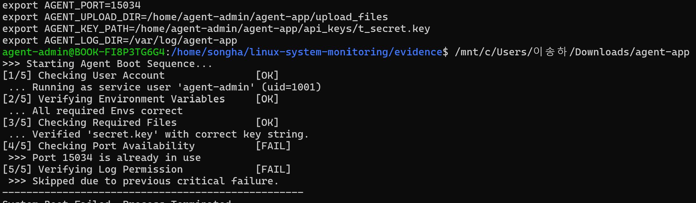
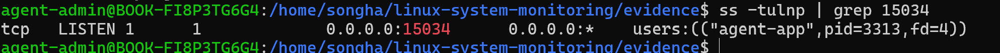
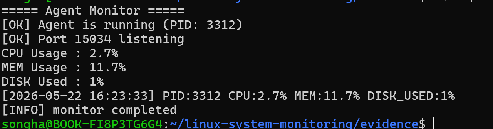
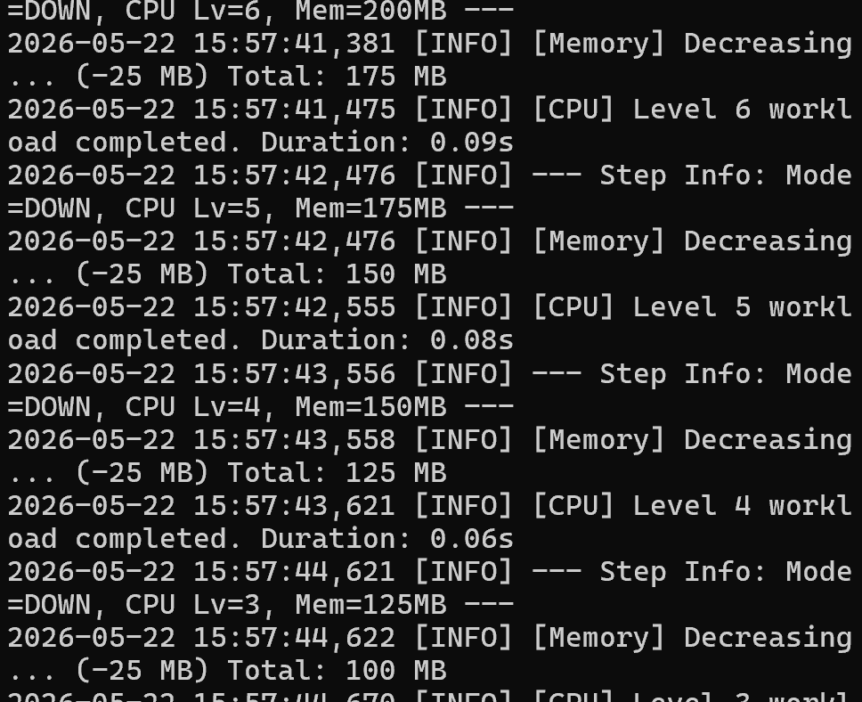
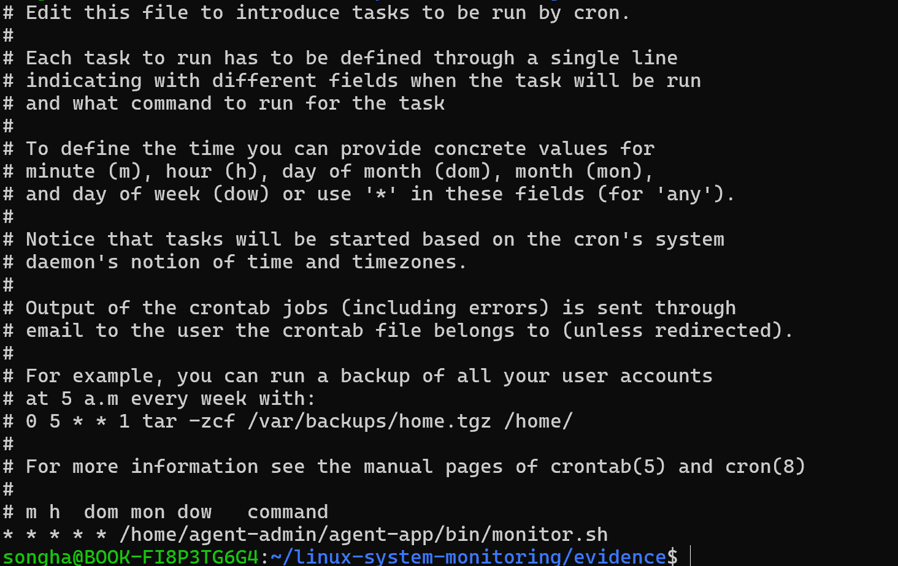

# Linux 시스템 관제 자동화

## 1. 프로젝트 개요

Ubuntu Linux 환경에서 서버 운영에 필요한 기본 보안 설정, 사용자/그룹 권한 관리, 애플리케이션 실행 환경 구성, 시스템 관제 자동화 스크립트를 구현하였다.

주요 수행 내용은 다음과 같다.

* SSH 포트 20022 변경
* Root 원격 접속 차단
* UFW 방화벽 설정
* 계정 및 그룹 생성
* 디렉토리 권한 및 ACL 확인
* 제공 애플리케이션 실행
* Bash 기반 monitor.sh 작성
* cron을 통한 매분 자동 실행
* monitor.log 누적 기록 확인

---

## 2. 개발 환경

* OS: Ubuntu 22.04 기반 WSL
* Shell: Bash
* Firewall: UFW
* App Port: 15034
* SSH Port: 20022
* Scheduler: cron

---

## 3. 사용자 및 그룹 구성

### 사용자

* agent-admin
* agent-dev
* agent-test

### 그룹

* agent-common
* agent-core

### 그룹 정책

* agent-common: agent-admin, agent-dev, agent-test
* agent-core: agent-admin, agent-dev

공용 파일 영역과 핵심 보안 영역을 분리하기 위해 그룹 기반 권한 정책을 적용하였다.

---

## 4. 디렉토리 및 권한 구성

### 디렉토리 구조

```bash
/home/agent-admin/agent-app
/home/agent-admin/agent-app/upload_files
/home/agent-admin/agent-app/api_keys
/var/log/agent-app
```

### 권한 정책

* upload_files: agent-common 그룹 접근 가능
* api_keys: agent-core 그룹만 접근 가능
* /var/log/agent-app: agent-core 그룹만 접근 가능

최소 권한 원칙을 적용하여 공용 영역과 보안 영역을 분리하였다.

---

## 5. SSH 보안 설정

SSH 기본 포트인 22번 대신 20022번 포트를 사용하도록 설정하였다.

```bash
Port 20022
PermitRootLogin no
```

Root 원격 접속을 차단하여 관리자 계정 직접 접근 위험을 줄였다.

---

## 6. 방화벽 설정

UFW를 활성화하고 필요한 포트만 허용하였다.

```bash
sudo ufw default deny incoming
sudo ufw default allow outgoing
sudo ufw allow 20022/tcp
sudo ufw allow 15034/tcp
sudo ufw enable
```

허용 포트:

* 20022/tcp: SSH
* 15034/tcp: Application

---

## 7. 애플리케이션 실행 환경

환경 변수는 다음과 같이 설정하였다.

```bash
export AGENT_HOME=/home/agent-admin/agent-app
export AGENT_PORT=15034
export AGENT_UPLOAD_DIR=/home/agent-admin/agent-app/upload_files
export AGENT_KEY_PATH=/home/agent-admin/agent-app/api_keys/t_secret.key
export AGENT_LOG_DIR=/var/log/agent-app
```

키 파일:

```bash
/home/agent-admin/agent-app/api_keys/t_secret.key
```

내용:

```text
agent_api_key_test
```

앱 실행 후 Boot Sequence 5단계 통과 및 Agent READY 상태를 확인하였다.

---

## 8. monitor.sh 구현

monitor.sh는 Bash로 작성하였다.

### 주요 기능

* agent-app 프로세스 확인
* TCP 15034 포트 LISTEN 확인
* CPU 사용률 수집
* 메모리 사용률 수집
* Root 디스크 사용률 수집
* monitor.log에 상태 기록

### 로그 파일 경로

```bash
/var/log/agent-app/monitor.log
```

### 로그 형식

```text
[YYYY-MM-DD HH:MM:SS] PID:... CPU:..% MEM:..% DISK_USED:..%
```

---

## 9. cron 자동 실행

monitor.sh가 매분 자동 실행되도록 crontab에 등록하였다.

```bash
* * * * * /home/agent-admin/agent-app/bin/monitor.sh
```

등록 후 monitor.log에 로그가 자동 누적되는 것을 확인하였다.

---

## 10. 증빙 자료

### SSH 포트 변경 및 Root 접속 차단



### UFW 방화벽 설정



### 계정 및 그룹 생성



### 디렉토리 및 ACL 권한



### 앱 Boot Sequence 및 Agent READY



### 앱 포트 15034 LISTEN



### monitor.sh 실행 결과



### monitor.log 누적 기록



### cron 등록 확인



---

## 11. 제출 파일

* README.md
* monitor.sh
* evidence 디렉토리 내 증빙 이미지

## 12. monitor.sh 비정상 종료 처리

monitor.sh는 핵심 점검 항목 실패 시 비정상 종료 상태를 반환하도록 구성하였다.

예시:

```bash
if ! pgrep -f "agent-app" > /dev/null; then
    echo "[FAIL] Agent process not found"
    exit 1
fi
```

운영 환경에서는 단순 출력만 하는 것이 아니라 종료 코드를 명확하게 반환해야 상위 모니터링 시스템(cron, systemd, CI/CD, 외부 관제 시스템 등)이 장애 여부를 자동 감지할 수 있다.

특히 `exit 1`은 “비정상 상태”를 의미하며 자동 알림 및 장애 대응 자동화의 기준으로 사용된다.

---

## 13. 로그 용량 관리(logrotate)

monitor.log는 지속적으로 누적되므로 로그 파일이 무한히 증가할 경우 디스크 Full 위험이 존재한다.

이를 방지하기 위해 운영 환경에서는 logrotate 기반 로그 순환 정책을 적용할 수 있다.

예시 설정:

```bash
/var/log/agent-app/monitor.log {
    size 10M
    rotate 10
    compress
    missingok
    notifempty
}
```

설명:

* size 10M: 로그가 10MB를 초과하면 회전
* rotate 10: 최대 10개 로그 유지
* compress: 오래된 로그 gzip 압축
* missingok: 로그 파일 없어도 에러 미발생
* notifempty: 빈 로그는 회전하지 않음

이를 통해 디스크 사용량 폭증을 방지할 수 있다.

---

## 14. 명령어 선택 이유

### 프로세스 확인

```bash
pgrep -f "agent-app"
```

사용 이유:

* 프로세스 이름 기반 검색 가능
* PID 직접 추출 가능
* 스크립트 자동화에 적합
* grep 조합보다 불필요한 프로세스 매칭 위험 감소

### 포트 확인

```bash
ss -tulnp
```

사용 이유:

* 최신 Linux 환경에서 netstat 대체 표준
* TCP/UDP LISTEN 상태 확인 가능
* PID 및 프로세스 정보 확인 가능
* 속도가 빠르고 운영 환경에서 널리 사용됨

---

## 15. CPU / MEM / DISK 파싱 및 로그 포맷 설계

CPU/MEM/DISK 값을 수집한 이유는 서버 운영에서 가장 기본적인 자원 상태 지표이기 때문이다.

### CPU

CPU 과부하는 응답 지연 및 서비스 장애 원인이 될 수 있다.

### MEM

메모리 부족 시 OOM(Out Of Memory) 상황이 발생할 수 있다.

### DISK

디스크 Full은 로그 기록 실패 및 서비스 장애를 유발할 수 있다.

로그 포맷은 다음과 같이 고정하였다.

```text
[YYYY-MM-DD HH:MM:SS] PID:... CPU:..% MEM:..% DISK_USED:..%
```

이유:

* 시간 기준 정렬 가능
* grep/awk 기반 분석 용이
* 운영자가 빠르게 상태 인식 가능
* 외부 로그 수집 시스템 연동 용이

---

## 16. monitor.sh 권한 정책

monitor.sh는 다음 정책을 만족하도록 구성하였다.

```bash
sudo chmod 750 monitor.sh
```

설명:

* Owner: 읽기/쓰기/실행 가능
* Group: 읽기/실행 가능
* Others: 접근 불가

또한 로그 디렉토리와 API Key 디렉토리를 agent-core 그룹으로 제한하여 최소 권한 원칙을 적용하였다.

---

## 17. SSH 설정의 보안 효과

기본 SSH 포트(22)는 인터넷 자동 스캐닝 및 브루트포스 공격 대상이 되는 경우가 많다.

포트를 20022로 변경함으로써 자동화된 단순 스캐닝 공격 노출 빈도를 줄일 수 있다.

또한:

```bash
PermitRootLogin no
```

설정을 통해 Root 계정 직접 로그인 자체를 차단하였다.

이를 통해:

* Root 계정 브루트포스 차단
* 최고 권한 계정 직접 노출 방지
* 권한 상승 추적 가능성 확보
* 계정별 감사 로그 분리

효과를 기대할 수 있다.

---

## 18. 경고 출력과 종료 처리 분리 이유

운영 환경에서는 모든 문제를 즉시 종료 대상으로 처리하지 않는다.

예를 들어:

* CPU 사용률 증가
* 디스크 사용률 증가

등은 경고 수준으로 처리할 수 있다.

반면:

* 프로세스 미존재
* 포트 LISTEN 실패

등은 서비스 장애로 간주해야 한다.

따라서 monitor.sh는 “경고”와 “치명적 실패”를 구분하는 구조가 필요하다.

---

## 19. > 와 >> 의 차이

```bash
>
```

는 기존 파일 내용을 덮어쓴다.

```bash
>>
```

는 기존 파일 끝에 내용을 추가한다.

monitor.log는 과거 기록을 유지해야 하므로:

```bash
>>
```

가 필요하다.

운영 로그는 시간 흐름 기반 분석이 중요하므로 append 방식이 적합하다.

---

## 20. 웹 서버 모니터링으로 변경 시 핵심 변경점

웹 서버 모니터링으로 확장될 경우:

* HTTP 응답 코드 확인
* 응답 속도 측정
* nginx/apache 프로세스 확인
* 특정 URL health check
* 동시 접속 수 확인

등이 추가적으로 필요하다.

예시:

```bash
curl -I http://localhost
```

를 통해 HTTP 200 응답 여부를 점검할 수 있다.

---

## 21. 프로세스는 살아있지만 포트가 열리지 않는 경우

원인 후보:

* 애플리케이션 내부 오류
* bind 실패
* 포트 충돌
* 방화벽 차단
* 권한 부족
* 설정 파일 오류

확인 순서:

1. 프로세스 존재 여부 확인
2. ss/netstat로 LISTEN 상태 확인
3. 애플리케이션 로그 확인
4. 방화벽 정책 확인
5. 설정 파일 확인

순으로 점검한다.

---

## 22. 로그 폭증 및 디스크 Full 대응

### 단기 대응

* 오래된 로그 삭제
* gzip 압축
* 불필요한 디버그 로그 비활성화
* 임시 디스크 확보

### 중기 대응

* logrotate 자동화
* 중앙 로그 수집 시스템 구축
* 로그 레벨 정책 정비
* 보관 기간 정책 설정

운영 환경에서는 디스크 Full이 발생하면 서비스 전체 장애로 이어질 수 있으므로 로그 관리 정책이 중요하다.


